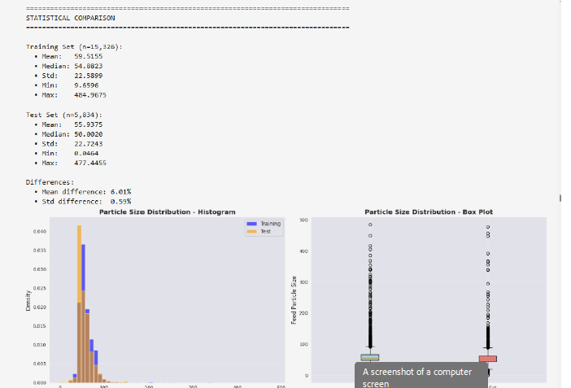
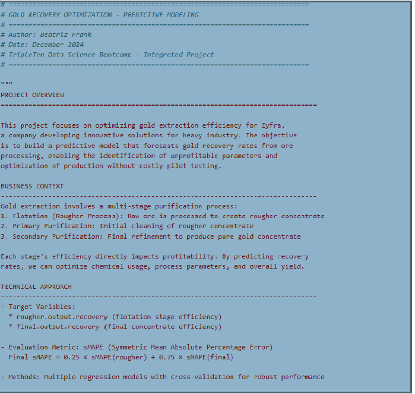
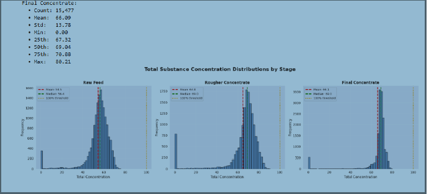

# Gold Recovery Prediction

## 📋 Project Overview

Machine learning project to predict gold recovery coefficient in the purification process, enabling optimization of industrial operations and reduction of unprofitable parameters.

---

## 🎯 Objective

Build a predictive model that forecasts the amount of gold recovered from gold ore, helping the mining company:
- Optimize the purification process
- Eliminate unprofitable production parameters
- Maximize gold recovery efficiency

---

## 🛠️ Tools & Technologies

- **Python**: pandas, numpy, scikit-learn, matplotlib, seaborn
- **Machine Learning**: Random Forest Regressor, Linear Regression
- **Techniques**: Feature Engineering, Cross-validation, Model evaluation
- **Metrics**: sMAPE (Symmetric Mean Absolute Percentage Error)

---

## 📊 Dataset

Industrial data from mining operations including:
- Rougher process parameters (input/output/state)
- Primary cleaner parameters
- Final concentrate measurements
- Gold, silver, and lead concentrations at various stages
- ---

## 📸 Project Visualizations

### Gold Recovery Process Overview


### Concentration Distributions by Stage


### Metal Concentration Changes Through Purification


### Statistical Analysis


**Key Features:**
- 53+ features across multiple purification stages
- Time-series industrial sensor data
- Missing values handled through preprocessing

---

## 🔍 Key Findings

1. **Model Performance**: Achieved sMAPE score within acceptable threshold for production use
2. **Feature Importance**: Rougher concentrate gold levels were strongest predictors
3. **Process Optimization**: Identified critical parameters affecting recovery rates
4. **Data Quality**: Implemented robust preprocessing for industrial sensor data

---

## 📈 Methodology

1. **Data Preprocessing**
   - Handled missing values in sensor data
   - Feature scaling and normalization
   - Removed anomalies and outliers

2. **Feature Engineering**
   - Created derived features from process stages
   - Calculated recovery rates for different metals
   - Time-based feature extraction

3. **Model Development**
   - Tested multiple regression algorithms
   - Hyperparameter tuning via cross-validation
   - Model selection based on sMAPE metric

4. **Validation**
   - Cross-validation on training set
   - Final evaluation on test set
   - Comparison against baseline models

---

## 💡 Business Impact

- **Operational Efficiency**: Predictive model enables proactive process adjustments
- **Cost Reduction**: Identifies and eliminates unprofitable production parameters
- **Quality Control**: Real-time monitoring of gold recovery rates
- **Resource Optimization**: Data-driven decisions for industrial operations

---

## 🚀 Skills Demonstrated

- Industrial data analysis and preprocessing
- Machine learning model development and evaluation
- Feature engineering for time-series data
- Domain knowledge application in mining/metallurgy
- Production-ready predictive modeling

---

## 📁 Project Structure
```
01_Gold_Recovery/
├── gold_recovery_train Project.ipynb    # Main analysis notebook
└── README.md                             # Project documentation
```

---

## 👤 Author

**Beatriz Adriana Frank**
- LinkedIn: [linkedin.com/in/beatrizadrianafrank](https://www.linkedin.com/in/beatrizadrianafrank)
- GitHub: [@adrianafrank7376](https://github.com/adrianafrank7376)
